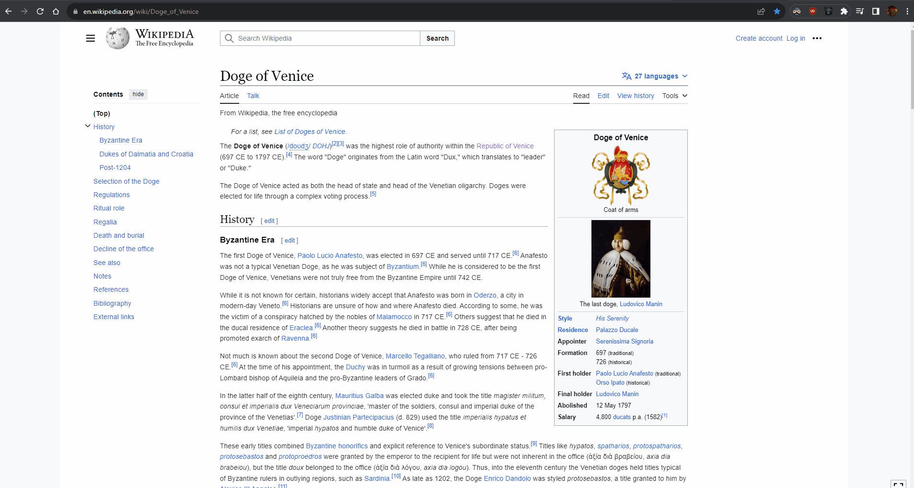

# Picture-in-picture selection screenshot

Work in progress !

## ressources

This allows you to populate PiP with pretty much anything: --- [document picture-in-picture](https://wicg.github.io/document-picture-in-picture/)  
To capture visible tab using chrome api --- [here](https://developer.chrome.com/docs/extensions/reference/api/tabs?hl=fr#method-captureVisibleTab)

## Install

- download the folder  
- load the extension with chrome (load unpacked extension)  
- click the extension icon  
- click the popup button  
- draw a rectangle and see result

## Explanation

Works in essence, the limitation for now is that it doesn't work on every  
site, test it on wikipedia for example not on twitch or youtube.
And it's ugly ofcourse

## TODO:

- add css to popup.html
- remove opacity layer from screenshot
